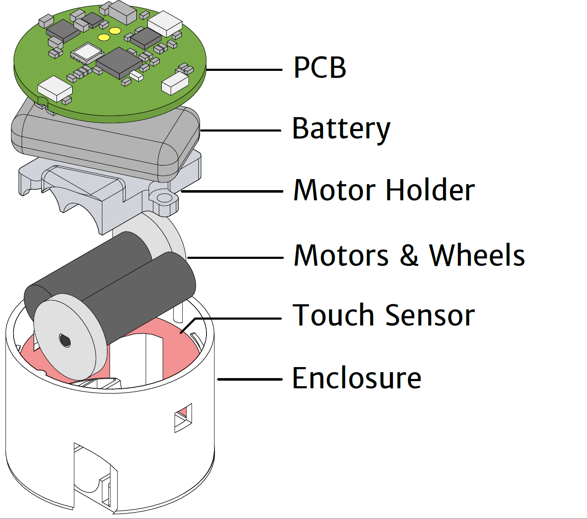
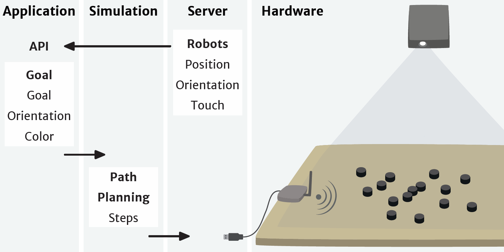
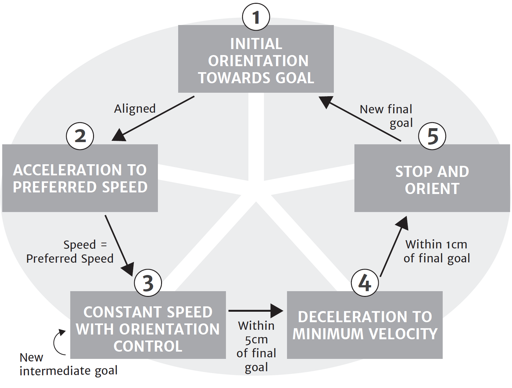
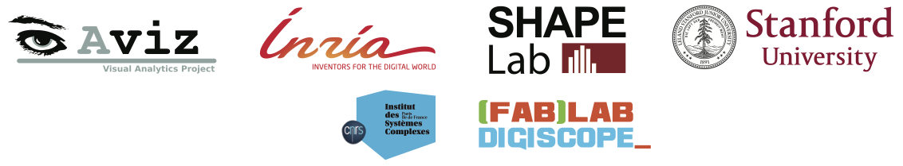

# Zooids: Building Blocks for Swarm User Interfaces \\  Extended Material

This paper introduces swarm user interfaces, a new class of human-computer interfaces comprised of many autonomous
robots that handle both display and interaction. We describe the design of Zooids, an open-source open-hardware platform
for developing tabletop swarm interfaces. The platform consists of a collection of custom-designed wheeled micro
robots each 2.6 cm in diameter, a radio base-station, a highspeed DLP structured light projector for optical tracking, and
a software framework for application development and control. We illustrate the potential of tabletop swarm user interfaces
through a set of application scenarios developed with Zooids, and discuss general design considerations unique to swarm user interfaces.

BadukBot is based on Zooid software and hardware to play the game Go/Baduk/Weiqi. https://en.wikipedia.org/wiki/Go_(game)

https://www.youtube.com/watch?time_continue=125&v=ZVdAfDMP3m0

## Hardware

The original Zooids are small custom-made robots as shown above; their dimensions are 26 mm in diameter, 21 mm in height
and they weight about 12 g. Each robot is powered by a 100 mAh LiPo battery and uses motor driven wheels. They contain a flexible elctrode for capacitive touch sensing. It communicates with the main computer through a NRF24L01+ chip on a separate receiver. Currently the limit for bots per receiver is 10. More can be added at a cost to performance/communication speed.

The original Zooid files have been converted from the original Altium files to KiCAD from scratch based on the original Zooid schematic pdf. The new PCBs and schematics are located in the Skinny_prototype directory (the original files were attempted to be converted with altium2kicad but would break on export.) The Proto BOM consolidates the components for Zooids, Receivers, chargers, and tools required into one sheet. The new BOM is mostly the same with changes to include prices, links, and modifications to quantities to make 81 (for a 9x9 board) and 361 (for a 19x19 board) bots in the Master BOM spreadsheet.

The pcb is being designed using the KiCAD schematics in KiCAD and FreeRouting and the 3D files are being created in MODO. The BadukBot breaks the design into 3 boards that encase the battery to attempt to reduce the foot print to 22.5 mm from the Zooid's 26 mm (go stones are 22.5 mm and allow for a full 19x19 board to fit in the projection area.) Please note this is my first time designing PCBs and a way for me to learn PCB design using KiCAD; No stranger to 3D modeling for 3D printing however. Dimensions for bots and the playspace based on https://senseis.xmp.net/?EquipmentDimensions.

We may try other DLP Lightcrafter EVMs to reduce cost ($140 vs $1400.)

### Tracking
The system uses a projector-based tracking system for robot position tracking as shown below. Using a high frame rate (3000Hz) projector (DLP LightCrafter Evaluation Module) from Texas Instruments Inc., a sequence of gray-coded patterns are projected onto a flat surface. Then, the photodiodes on the robot independently decodes into a location within the projected area. 
The instruction for setting up this projector-based tracking system is included in the repository. 

## Software

The communication structure consists of four main layers from highest to lowest level: Application, Simulation, Server, and Hardware. 

At the application level, the desired positions of the robots are computed. These desired positions are transmitted to
the simulation layer through a network socket. The application programmer can choose between two control strategies:
Proportional-Integral-Derivative (PID) position control or Hybrid Reciprocal Velocity Obstacles (HRVO) combined
with PID (these options are explained in the next paragraphs). Based on the chosen control strategy, the simulation layer
computes the goal positions of the robots, either final positions for PID or intermediate points for HRVO, and sends them to
the server. Finally, the server layer dispatches commands to the individual zooids, while at the same time monitoring their status and position.

Each robot independently controls its motion through a PID controller based on the state machine shown below. Given a final goal, the robot initially turns itself in the right direction and, once aligned, accelerates to its user-defined preferred speed. When it reaches the speed, it maintains it with a PID control on the orientation to ensure its direction towards the final goal. When a new incremental goal is given, it will still move at same speed but the PID control on orientation will direct the robot towards the new intermediate goal. When the robot arrives within 5 cm of the final goal, it slows down to its minimum velocity and once within 1 cm of the final goal, it stops and orients itself as commanded by the application programmer. To enable smooth transitions between the incremental goal positions, robots are given their next position at 60 Hz.

The modified software for playing Go using SwarmUI (GoSwarm) can be found at https://github.com/nheyn/GoSwarm and modified firmware will be maintained in this repo.

Goals include having defined areas for the bots including game play area on a grid, automatically arranging bots to a Go bowl area, automatically moving captured stones/bots to a defined captured bowl area, queueing bots for the next turn, and game play rules like passing/resigning. Resources and goals for features can be found at https://github.com/supersurfer92/SwarmUI-BadukBots/blob/master/Software/Go%20Features%2C%20Programming%20Gits%2C%20and%20theory.txt

## Acknowledgments 

The original SwarmUI project (https://github.com/ShapeLab/SwarmUI) is a joint work between the Shape Lab at Stanford University (USA) and the Aviz team at Inria (France).
It was partially funded by the Région Ile de France, DIM ISC-PIF. We would also like to thank Alexa Siu, Shenli Yuan, Ernesto Ramirez and Pham Minh Hieu for investing so much time and efforts in making this work possible. 

BadukBot and GoSwarm is a hobby project created by Caleb Cover and Nick Heyn based on SwarmUI.

The original licenses are retained where applicable and the licenses used for new hardware developed will use a license that follows the Opens Source Hardware Association definition of Open Source Hardware (https://www.oshwa.org/definition/.) (Caleb works for OSHWA.)

 This work is licensed under a <a rel="license" href="http://creativecommons.org/licenses/by-sa/4.0/">Creative Commons Attribution-ShareAlike 4.0 International License</a>.
